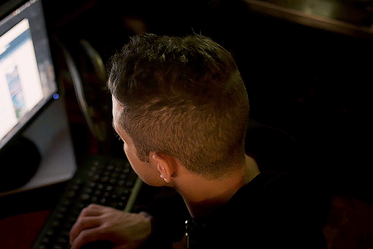

# Hi, I'm **r3dBust3r** from Morocco

🔌 **Background in Networking & System Administration (Client/Server)**  
💻 **Former Web Developer**  
🛡️ **Currently diving deep into Cybersecurity**  
🚀 **Passionate about Hacking and Cyber Security**

---

## Web Technologies

  
  
  
  
  
  
  
  
  
  
  
  

---

## Cyber Security Technologies & Tools

  
  
  
  
  
  
  
  
  
  
  
  

---

  
  
  
  
  
  
  
  
  
  
  
  
  
  
  
  
  

